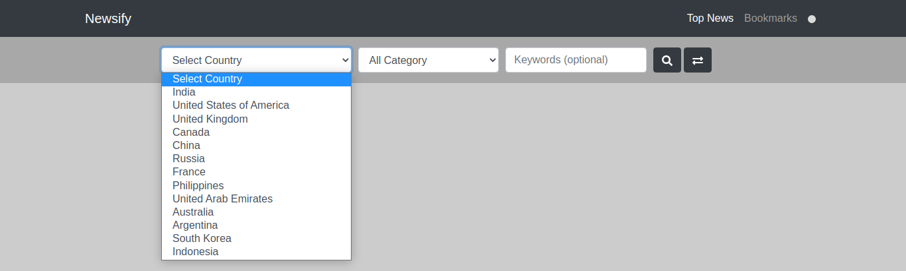
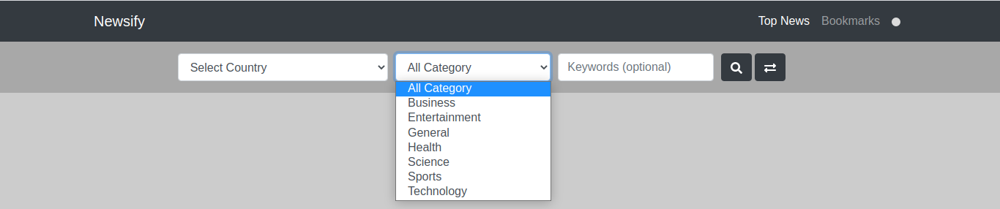
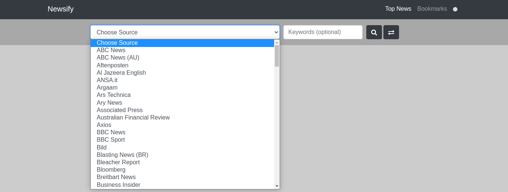
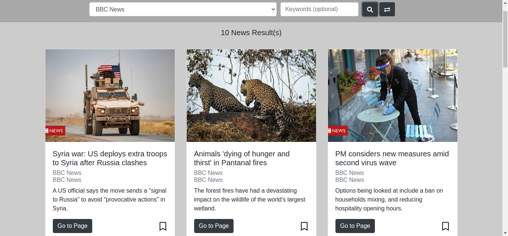
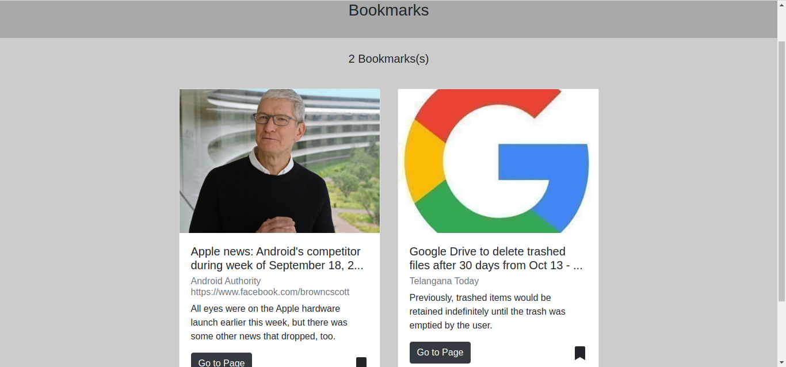

<div align="center">
    🔥 <b>Newsify</b> 🔥
    A web app (single page application) created with react.js, redux and react-bootstrap using free news api.
</div>

## Demo

[Live Demo](https://newsify-anuragbhu.netlify.app/)

### Features

- ⚒️ Search top news by country, category or by media source

- 📊 Can bookmark individual news (all bookmarks are save in browser localstorage)

- 📱 Switch from night mode to light mode

### Issues
- [x] No longer under active development
- [ ] Advance search page

### Overview

<!---  SCREENSHOOT   -->
<div align="center">
    <br>
    <br>
    <br>
    <br>
    <br>
    
</div>

### Project setup
```
npm install
```

### Compiles and hot-reloads for development

```
npm start
```

### Compiles and minifies for production

```
npm run build
```

### News API page

https://newsapi.org/
