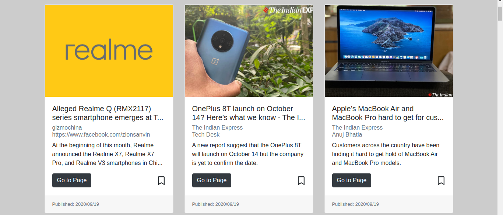

## react-news-search-and-bookmark

A web app (single page application) created with react.js, redux and react-bootstrap using free news api.

## Demo

[Live Demo](https://newsify-anuragbhu.netlify.app/)

### Features

- Search top news by country, category or by media source
- Can bookmark individual news (all bookmarks are save in browser localstorage)
- Switch from dark mode to light mode

### Todos

- Advance search page

### Overview

<!---  SCREENSHOOT   -->
<div align="center">
    <br>
    <br>
    <br>
    <br>
    <br>
    
</div>

## Project setup

for local development create an .env.local file outside the src folder and copy the key below:

REACT_APP_NEWS_API_KEY = 'add your news api key here'

---

for production create an .env file outside the src folder and copy the key below:

NEWS_API_KEY = 'add your news api key here'

--

```
npm install
```

### Compiles and hot-reloads for development

```
npm start
```

### Compiles and minifies for production

```
npm run build
```

### News API page

https://newsapi.org/
